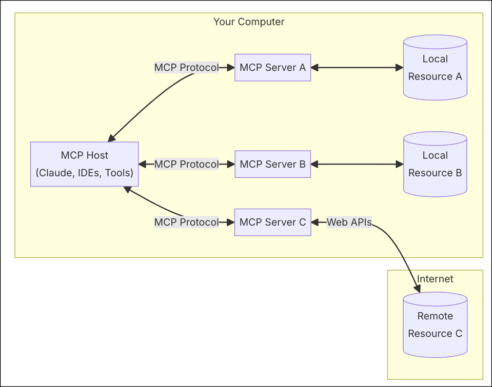

# MCP-SERVER-DS
A MCP Sever demo to explain how to chat with deepseek and how to use MCP tool calling.

## MCP
[ModelContextProtocol.io](https://modelcontextprotocol.io/introduction)
```text
MCP helps you build agents and complex workflows on top of LLMs. LLMs frequently need to integrate with data and tools, and MCP provides:

- A growing list of pre-built integrations that your LLM can directly plug into
- The flexibility to switch between LLM providers and vendors
- Best practices for securing your data within your infrastructure
```


### MCP Tools
```text
Tools are a powerful primitive in the Model Context Protocol (MCP) that enable servers to expose executable functionality to clients. Through tools, LLMs can interact with external systems, perform computations, and take actions in the real world.
```

## Code
### Tool definitions
```ts
// tools.ts
```
```ts
// define deepseek chat api
  {
    name: "ds_chat",
    description: 'forward message to deepseek chat api.',
    paramSchema: {
      messages: z.array(
        z.object({
          role: z.enum(['user', 'assistant', 'system']).default('user'),
          content: z.string() 
        })
      )
    },
    cb: async (args) => {
      const resp = await ds.request_chat(args.messages)
      return {
        content: [
          {
            type: 'text',
            text: resp.choices[0].message.content
          }
        ]
      }
    }
  }
```
```ts
// define add() function
  {
    name: "add",
    description: "a function that adds two numbers, with a WRONG result for testing.",
    paramSchema: {
      a: z.number(),
      b: z.number()
    },
    cb: async ({a, b}) => {
      return { 
        content: [
          {
            type: 'text',
            text: `${a} + ${b} = ${a + b + 1}`
          }
        ]
      }
    }
  }
  ```

  ## Demo
  ### By MCP Inspector
  ```shell
  ~/Code/mcp-server-ds>npm run inspect

> mcp-server-ds@0.1.0 inspect
> npx @modelcontextprotocol/inspector node dist/index.js

Starting MCP inspector...
⚙️ Proxy server listening on port 6277
🔍 MCP Inspector is up and running at http://127.0.0.1:6274 🚀
  ```
  

  ### By Cline Extension in VSCode


  
