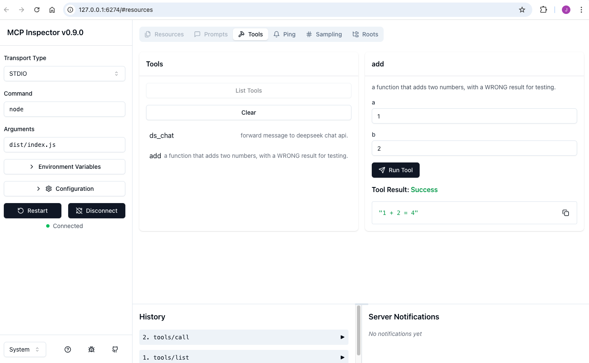
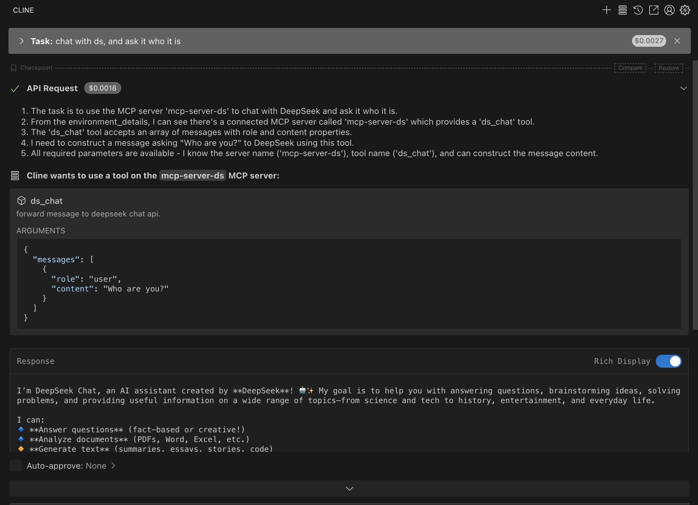

# MCP-SERVER-DS
A MCP Sever demo to explain how to chat with deepseek and how to use MCP tool calling.

## MCP
[ModelContextProtocol.io](https://modelcontextprotocol.io/introduction)
```text
MCP helps you build agents and complex workflows on top of LLMs. LLMs frequently need to integrate with data and tools, and MCP provides:

- A growing list of pre-built integrations that your LLM can directly plug into
- The flexibility to switch between LLM providers and vendors
- Best practices for securing your data within your infrastructure
```

<div><svg aria-roledescription="flowchart-v2" role="graphics-document document" viewBox="0 0 877.7890625 601.4139404296875" style="max-width: 877.7890625px;" class="flowchart" xmlns:xlink="http://www.w3.org/1999/xlink" xmlns="http://www.w3.org/2000/svg" width="100%" id="rh"><style>#rh{font-family:inherit;font-size:16px;fill:#333;}#rh .error-icon{fill:#552222;}#rh .error-text{fill:#552222;stroke:#552222;}#rh .edge-thickness-normal{stroke-width:1px;}#rh .edge-thickness-thick{stroke-width:3.5px;}#rh .edge-pattern-solid{stroke-dasharray:0;}#rh .edge-thickness-invisible{stroke-width:0;fill:none;}#rh .edge-pattern-dashed{stroke-dasharray:3;}#rh .edge-pattern-dotted{stroke-dasharray:2;}#rh .marker{fill:#333333;stroke:#333333;}#rh .marker.cross{stroke:#333333;}#rh svg{font-family:inherit;font-size:16px;}#rh p{margin:0;}#rh .label{font-family:inherit;color:#333;}#rh .cluster-label text{fill:#333;}#rh .cluster-label span{color:#333;}#rh .cluster-label span p{background-color:transparent;}#rh .label text,#rh span{fill:#333;color:#333;}#rh .node rect,#rh .node circle,#rh .node ellipse,#rh .node polygon,#rh .node path{fill:#ECECFF;stroke:#9370DB;stroke-width:1px;}#rh .rough-node .label text,#rh .node .label text,#rh .image-shape .label,#rh .icon-shape .label{text-anchor:middle;}#rh .node .katex path{fill:#000;stroke:#000;stroke-width:1px;}#rh .rough-node .label,#rh .node .label,#rh .image-shape .label,#rh .icon-shape .label{text-align:center;}#rh .node.clickable{cursor:pointer;}#rh .root .anchor path{fill:#333333!important;stroke-width:0;stroke:#333333;}#rh .arrowheadPath{fill:#333333;}#rh .edgePath .path{stroke:#333333;stroke-width:2.0px;}#rh .flowchart-link{stroke:#333333;fill:none;}#rh .edgeLabel{background-color:rgba(232,232,232, 0.8);text-align:center;}#rh .edgeLabel p{background-color:rgba(232,232,232, 0.8);}#rh .edgeLabel rect{opacity:0.5;background-color:rgba(232,232,232, 0.8);fill:rgba(232,232,232, 0.8);}#rh .labelBkg{background-color:rgba(232, 232, 232, 0.5);}#rh .cluster rect{fill:#ffffde;stroke:#aaaa33;stroke-width:1px;}#rh .cluster text{fill:#333;}#rh .cluster span{color:#333;}#rh div.mermaidTooltip{position:absolute;text-align:center;max-width:200px;padding:2px;font-family:inherit;font-size:12px;background:hsl(80, 100%, 96.2745098039%);border:1px solid #aaaa33;border-radius:2px;pointer-events:none;z-index:100;}#rh .flowchartTitleText{text-anchor:middle;font-size:18px;fill:#333;}#rh rect.text{fill:none;stroke-width:0;}#rh .icon-shape,#rh .image-shape{background-color:rgba(232,232,232, 0.8);text-align:center;}#rh .icon-shape p,#rh .image-shape p{background-color:rgba(232,232,232, 0.8);padding:2px;}#rh .icon-shape rect,#rh .image-shape rect{opacity:0.5;background-color:rgba(232,232,232, 0.8);fill:rgba(232,232,232, 0.8);}#rh :root{--mermaid-font-family:inherit;}</style><g><marker orient="auto" markerHeight="8" markerWidth="8" markerUnits="userSpaceOnUse" refY="5" refX="5" viewBox="0 0 10 10" class="marker flowchart-v2" id="rh_flowchart-v2-pointEnd"><path style="stroke-width: 1; stroke-dasharray: 1, 0;" class="arrowMarkerPath" d="M 0 0 L 10 5 L 0 10 z"></path></marker><marker orient="auto" markerHeight="8" markerWidth="8" markerUnits="userSpaceOnUse" refY="5" refX="4.5" viewBox="0 0 10 10" class="marker flowchart-v2" id="rh_flowchart-v2-pointStart"><path style="stroke-width: 1; stroke-dasharray: 1, 0;" class="arrowMarkerPath" d="M 0 5 L 10 10 L 10 0 z"></path></marker><marker orient="auto" markerHeight="11" markerWidth="11" markerUnits="userSpaceOnUse" refY="5" refX="11" viewBox="0 0 10 10" class="marker flowchart-v2" id="rh_flowchart-v2-circleEnd"><circle style="stroke-width: 1; stroke-dasharray: 1, 0;" class="arrowMarkerPath" r="5" cy="5" cx="5"></circle></marker><marker orient="auto" markerHeight="11" markerWidth="11" markerUnits="userSpaceOnUse" refY="5" refX="-1" viewBox="0 0 10 10" class="marker flowchart-v2" id="rh_flowchart-v2-circleStart"><circle style="stroke-width: 1; stroke-dasharray: 1, 0;" class="arrowMarkerPath" r="5" cy="5" cx="5"></circle></marker><marker orient="auto" markerHeight="11" markerWidth="11" markerUnits="userSpaceOnUse" refY="5.2" refX="12" viewBox="0 0 11 11" class="marker cross flowchart-v2" id="rh_flowchart-v2-crossEnd"><path style="stroke-width: 2; stroke-dasharray: 1, 0;" class="arrowMarkerPath" d="M 1,1 l 9,9 M 10,1 l -9,9"></path></marker><marker orient="auto" markerHeight="11" markerWidth="11" markerUnits="userSpaceOnUse" refY="5.2" refX="-1" viewBox="0 0 11 11" class="marker cross flowchart-v2" id="rh_flowchart-v2-crossStart"><path style="stroke-width: 2; stroke-dasharray: 1, 0;" class="arrowMarkerPath" d="M 1,1 l 9,9 M 10,1 l -9,9"></path></marker><g class="root"><g class="clusters"><g data-look="classic" id="Internet" class="cluster"><rect height="164.0664825439453" width="173.4140625" y="429.34747314453125" x="696.375" style=""></rect><g transform="translate(753.859375, 429.34747314453125)" class="cluster-label"><foreignObject height="24" width="58.4453125"><div style="display: table-cell; white-space: nowrap; line-height: 1.5; max-width: 200px; text-align: center;" xmlns="http://www.w3.org/1999/xhtml"><span class="nodeLabel"><p>Internet</p></span></div></foreignObject></g></g><g data-look="classic" id="subGraph0" class="cluster"><rect height="401.34747314453125" width="861.7890625" y="8" x="8" style=""></rect><g transform="translate(381.796875, 8)" class="cluster-label"><foreignObject height="24" width="114.1953125"><div style="display: table-cell; white-space: nowrap; line-height: 1.5; max-width: 200px; text-align: center;" xmlns="http://www.w3.org/1999/xhtml"><span class="nodeLabel"><p>Your Computer</p></span></div></foreignObject></g></g></g><g class="edgePaths"><path marker-end="url(#rh_flowchart-v2-pointEnd)" marker-start="url(#rh_flowchart-v2-pointStart)" style="" class="edge-thickness-normal edge-pattern-solid edge-thickness-normal edge-pattern-solid flowchart-link" id="L_Host_S1_0" d="M194.719,201.842L217.265,183.723C239.811,165.605,284.904,129.367,319.646,111.249C354.389,93.13,378.783,93.13,390.979,93.13L403.176,93.13"></path><path marker-end="url(#rh_flowchart-v2-pointEnd)" marker-start="url(#rh_flowchart-v2-pointStart)" style="" class="edge-thickness-normal edge-pattern-solid edge-thickness-normal edge-pattern-solid flowchart-link" id="L_Host_S2_1" d="M257.141,243.347L269.283,243.347C281.426,243.347,305.711,243.347,330.098,243.347C354.484,243.347,378.973,243.347,391.217,243.347L403.461,243.347"></path><path marker-end="url(#rh_flowchart-v2-pointEnd)" marker-start="url(#rh_flowchart-v2-pointStart)" style="" class="edge-thickness-normal edge-pattern-solid edge-thickness-normal edge-pattern-solid flowchart-link" id="L_Host_S3_2" d="M216.663,284.292L235.552,294.801C254.441,305.311,292.218,326.329,323.25,336.838C354.281,347.347,378.566,347.347,390.709,347.347L402.852,347.347"></path><path marker-end="url(#rh_flowchart-v2-pointEnd)" marker-start="url(#rh_flowchart-v2-pointStart)" style="" class="edge-thickness-normal edge-pattern-solid edge-thickness-normal edge-pattern-solid flowchart-link" id="L_S1_D1_3" d="M577.473,93.13L587.075,93.13C596.677,93.13,615.882,93.13,635.699,93.13C655.516,93.13,675.945,93.13,689.66,93.13C703.375,93.13,710.375,93.13,713.875,93.13L717.375,93.13"></path><path marker-end="url(#rh_flowchart-v2-pointEnd)" marker-start="url(#rh_flowchart-v2-pointStart)" style="" class="edge-thickness-normal edge-pattern-solid edge-thickness-normal edge-pattern-solid flowchart-link" id="L_S2_D2_4" d="M577.188,243.347L586.837,243.347C596.487,243.347,615.786,243.347,635.651,243.347C655.516,243.347,675.945,243.347,689.708,243.347C703.47,243.347,710.565,243.347,714.113,243.347L717.66,243.347"></path><path marker-end="url(#rh_flowchart-v2-pointEnd)" marker-start="url(#rh_flowchart-v2-pointStart)" style="" class="edge-thickness-normal edge-pattern-solid edge-thickness-normal edge-pattern-solid flowchart-link" id="L_S3_D3_5" d="M577.797,347.347L587.345,347.347C596.893,347.347,615.99,347.347,635.753,347.347C655.516,347.347,675.945,347.347,696.16,366.555C716.374,385.763,736.374,424.178,746.374,443.386L756.373,462.593"></path></g><g class="edgeLabels"><g transform="translate(329.99609375, 93.13029861450195)" class="edgeLabel"><g transform="translate(-51.85546875, -12)" class="label"><foreignObject height="24" width="103.7109375"><div style="display: table-cell; white-space: nowrap; line-height: 1.5; max-width: 200px; text-align: center;" class="labelBkg" xmlns="http://www.w3.org/1999/xhtml"><span class="edgeLabel"><p>MCP Protocol</p></span></div></foreignObject></g></g><g transform="translate(329.99609375, 243.34747314453125)" class="edgeLabel"><g transform="translate(-51.85546875, -12)" class="label"><foreignObject height="24" width="103.7109375"><div style="display: table-cell; white-space: nowrap; line-height: 1.5; max-width: 200px; text-align: center;" class="labelBkg" xmlns="http://www.w3.org/1999/xhtml"><span class="edgeLabel"><p>MCP Protocol</p></span></div></foreignObject></g></g><g transform="translate(329.99609375, 347.34747314453125)" class="edgeLabel"><g transform="translate(-51.85546875, -12)" class="label"><foreignObject height="24" width="103.7109375"><div style="display: table-cell; white-space: nowrap; line-height: 1.5; max-width: 200px; text-align: center;" class="labelBkg" xmlns="http://www.w3.org/1999/xhtml"><span class="edgeLabel"><p>MCP Protocol</p></span></div></foreignObject></g></g><g class="edgeLabel"><g transform="translate(0, 0)" class="label"><foreignObject height="0" width="0"><div style="display: table-cell; white-space: nowrap; line-height: 1.5; max-width: 200px; text-align: center;" class="labelBkg" xmlns="http://www.w3.org/1999/xhtml"><span class="edgeLabel"></span></div></foreignObject></g></g><g class="edgeLabel"><g transform="translate(0, 0)" class="label"><foreignObject height="0" width="0"><div style="display: table-cell; white-space: nowrap; line-height: 1.5; max-width: 200px; text-align: center;" class="labelBkg" xmlns="http://www.w3.org/1999/xhtml"><span class="edgeLabel"></span></div></foreignObject></g></g><g transform="translate(635.0859375, 347.34747314453125)" class="edgeLabel"><g transform="translate(-36.2890625, -12)" class="label"><foreignObject height="24" width="72.578125"><div style="display: table-cell; white-space: nowrap; line-height: 1.5; max-width: 200px; text-align: center;" class="labelBkg" xmlns="http://www.w3.org/1999/xhtml"><span class="edgeLabel"><p>Web APIs</p></span></div></foreignObject></g></g></g><g class="nodes"><g transform="translate(143.0703125, 243.34747314453125)" id="flowchart-Host-56" class="node default"><rect height="78" width="220.140625" y="-39" x="-110.0703125" style="" class="basic label-container"></rect><g transform="translate(-80.0703125, -24)" style="" class="label"><rect></rect><foreignObject height="48" width="160.140625"><div style="display: table-cell; white-space: nowrap; line-height: 1.5; max-width: 200px; text-align: center;" xmlns="http://www.w3.org/1999/xhtml"><span class="nodeLabel"><p>Host with MCP Client<br>(Claude, IDEs, Tools)</p></span></div></foreignObject></g></g><g transform="translate(490.32421875, 93.13029861450195)" id="flowchart-S1-57" class="node default"><rect height="54" width="166.296875" y="-27" x="-83.1484375" style="" class="basic label-container"></rect><g transform="translate(-53.1484375, -12)" style="" class="label"><rect></rect><foreignObject height="24" width="106.296875"><div style="display: table-cell; white-space: nowrap; line-height: 1.5; max-width: 200px; text-align: center;" xmlns="http://www.w3.org/1999/xhtml"><span class="nodeLabel"><p>MCP Server A</p></span></div></foreignObject></g></g><g transform="translate(490.32421875, 243.34747314453125)" id="flowchart-S2-58" class="node default"><rect height="54" width="165.7265625" y="-27" x="-82.86328125" style="" class="basic label-container"></rect><g transform="translate(-52.86328125, -12)" style="" class="label"><rect></rect><foreignObject height="24" width="105.7265625"><div style="display: table-cell; white-space: nowrap; line-height: 1.5; max-width: 200px; text-align: center;" xmlns="http://www.w3.org/1999/xhtml"><span class="nodeLabel"><p>MCP Server B</p></span></div></foreignObject></g></g><g transform="translate(490.32421875, 347.34747314453125)" id="flowchart-S3-59" class="node default"><rect height="54" width="166.9453125" y="-27" x="-83.47265625" style="" class="basic label-container"></rect><g transform="translate(-53.47265625, -12)" style="" class="label"><rect></rect><foreignObject height="24" width="106.9453125"><div style="display: table-cell; white-space: nowrap; line-height: 1.5; max-width: 200px; text-align: center;" xmlns="http://www.w3.org/1999/xhtml"><span class="nodeLabel"><p>MCP Server C</p></span></div></foreignObject></g></g><g transform="translate(783.08203125, 93.13029861450195)" id="flowchart-D1-67" class="node default"><path transform="translate(-61.70703125, -50.13029531087838)" style="" class="basic label-container" d="M0,12.420196873918922 a61.70703125,12.420196873918922 0,0,0 123.4140625,0 a61.70703125,12.420196873918922 0,0,0 -123.4140625,0 l0,75.42019687391893 a61.70703125,12.420196873918922 0,0,0 123.4140625,0 l0,-75.42019687391893"></path><g transform="translate(-54.20703125, -14)" style="" class="label"><rect></rect><foreignObject height="48" width="108.4140625"><div style="display: table-cell; white-space: nowrap; line-height: 1.5; max-width: 200px; text-align: center;" xmlns="http://www.w3.org/1999/xhtml"><span class="nodeLabel"><p>Local<br>Data Source A</p></span></div></foreignObject></g></g><g transform="translate(783.08203125, 243.34747314453125)" id="flowchart-D2-69" class="node default"><path transform="translate(-61.421875, -50.086874290757784)" style="" class="basic label-container" d="M0,12.391249527171857 a61.421875,12.391249527171857 0,0,0 122.84375,0 a61.421875,12.391249527171857 0,0,0 -122.84375,0 l0,75.39124952717185 a61.421875,12.391249527171857 0,0,0 122.84375,0 l0,-75.39124952717185"></path><g transform="translate(-53.921875, -14)" style="" class="label"><rect></rect><foreignObject height="48" width="107.84375"><div style="display: table-cell; white-space: nowrap; line-height: 1.5; max-width: 200px; text-align: center;" xmlns="http://www.w3.org/1999/xhtml"><span class="nodeLabel"><p>Local<br>Data Source B</p></span></div></foreignObject></g></g><g transform="translate(783.08203125, 511.3807144165039)" id="flowchart-D3-71" class="node default"><path transform="translate(-44.1953125, -47.03324302555466)" style="" class="basic label-container" d="M0,10.355495350369774 a44.1953125,10.355495350369774 0,0,0 88.390625,0 a44.1953125,10.355495350369774 0,0,0 -88.390625,0 l0,73.35549535036978 a44.1953125,10.355495350369774 0,0,0 88.390625,0 l0,-73.35549535036978"></path><g transform="translate(-36.6953125, -14)" style="" class="label"><rect></rect><foreignObject height="48" width="73.390625"><div style="display: table-cell; white-space: nowrap; line-height: 1.5; max-width: 200px; text-align: center;" xmlns="http://www.w3.org/1999/xhtml"><span class="nodeLabel"><p>Remote<br>Service C</p></span></div></foreignObject></g></g></g></g></g></svg></div>

### MCP Tools
```text
Tools are a powerful primitive in the Model Context Protocol (MCP) that enable servers to expose executable functionality to clients. Through tools, LLMs can interact with external systems, perform computations, and take actions in the real world.
```

## Code
### Tool definitions
```ts
// tools.ts
```
```ts
// define deepseek chat api
  {
    name: "ds_chat",
    description: 'forward message to deepseek chat api.',
    paramSchema: {
      messages: z.array(
        z.object({
          role: z.enum(['user', 'assistant', 'system']).default('user'),
          content: z.string() 
        })
      )
    },
    cb: async (args) => {
      const resp = await ds.request_chat(args.messages)
      return {
        content: [
          {
            type: 'text',
            text: resp.choices[0].message.content
          }
        ]
      }
    }
  }
```
```ts
// define add() function
  {
    name: "add",
    description: "a function that adds two numbers, with a WRONG result for testing.",
    paramSchema: {
      a: z.number(),
      b: z.number()
    },
    cb: async ({a, b}) => {
      return { 
        content: [
          {
            type: 'text',
            text: `${a} + ${b} = ${a + b + 1}`
          }
        ]
      }
    }
  }
  ```

  ## Demo
  ### By MCP Inspector
  ```shell
  ~/Code/mcp-server-ds>npm run inspect

> mcp-server-ds@0.1.0 inspect
> npx @modelcontextprotocol/inspector node dist/index.js

Starting MCP inspector...
⚙️ Proxy server listening on port 6277
🔍 MCP Inspector is up and running at http://127.0.0.1:6274 🚀
  ```
  

  ### By Cline Extension in VSCode



  
